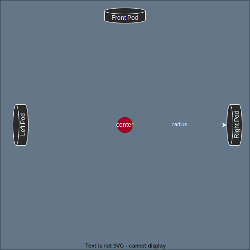

# The Odometry Pods

## Wheel Distance 

Calculating the distance each pod travels per encoder tick:

``` Java
private final double podWheelRadius = 1.0;
private final double ticksPerRotation = 8192;
private final double inchesPerRotation = 2 * Math.PI * podWheelRadius;
private final double inchesPerTick = inchesPerRotation / ticksPerRotation;
```
## Robot Localization From Encoders

With three encoder values, arranged as shown in Figure 1 below, it should be 
possible to estimate changes in robot position and angle based on wheel 
rotation amounts. 



**Figure 1:** Layout of odometry pod wheels on the robot

We define the state of the robot as follows: 

$$ \vec{x} = \left [ \begin{array}{cc} r_x & r_y & \theta \end{array} \right ] $$

Where $$ r_x $$ is the x field position, $$ r_y $$ is the y field position, and 
$$ \theta $$ is the angle with respect to the field. These exact values cannot be
measured directly from the odometry pods, but their relative changes can be 
estimated. To make progress on this, we consider angles and distance traveled 
separately. 

### Robot Rotation

$$ d\theta/{dt} = \frac{d(d_{lp} - d_{rp}) / r_{lr} }{dt} $$

where $d_{lp}$ and $d_{rp}$ are the left pod distance traveled and the right pod 
distance traveled, respectively and $r_{lr}$ is the distance between the left 
and right pod, respectively. 

### Estimating Distance Traveled in Each Direction Generic Wheel Diagram.drawio.png

For a given pod at distance $\vec{r}$ from the center of the robot, and measuring 
distance traveled perpendicular to the radius, we can write the distance measured, $d_m$ 
according to:

$$ d_m = \left| r \right|  \Delta \theta + d_{traveled} $$

Since the pods are all at a distance r from the center, the relation between
distance traveled and the rotation of the robot are coupled. The distance traveled
in the y (forward) direction is the measured forward motion on a pod (left or right) 
minus the distance it would be expected to travel based on the robot's rotation:

$$ \frac{dy}{dt} = lp - r_l \frac{d\theta}{dt} $$

## A Generalized Solution

The formalism I started with seemed a little convoluted, so I thought it would be helpful 
to start from first-principles. It's helpful to flip the problem around and calculate the 
expected **pod measurement** based on the motion and rotation of the robot. Figure 2
illustrates the concept: 


*Figure 2: The layout of the odometry pods and definitions of vectors.*

From these definitions, we can compute the measured distance on an arbitrary odometry pod, $d_m$,
equal to the sum of:

  * (a) distance traveled by the center of the robot $\vec d$ dotted with the measrement 
unit vector $\hat m$ and 
  * (b) the rotation of the robot $\theta$ times the cross product of the pod's measurement 
vector, $\hat m$ and the radius to the odometry pod from the center of the robot, $\vec r$.

$$ d_m = \underbrace{ \vec d \cdot \hat m_{pod} }_a + \underbrace{\theta \left( { \hat m_{pod} } \times \vec r_{pod} \right)}_b $$


